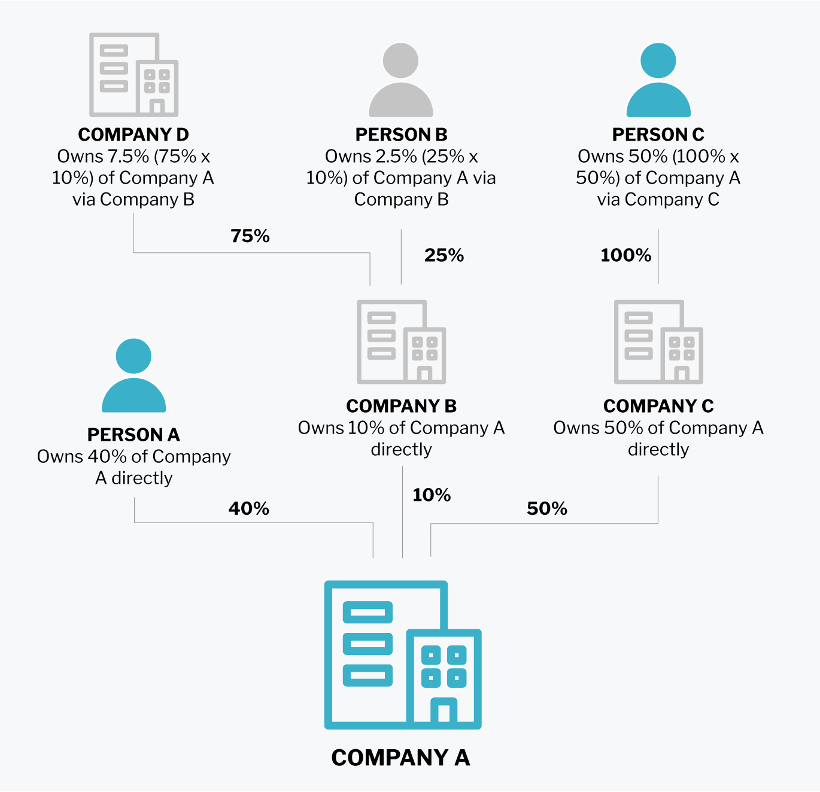

# Onboarding API Pilot

Note: This group of endpoints is in BETA and only available to API pilot partners.

## Introduction

This document provides important information relevant to integrating with the Onboarding API in the Pilot phase.

Before the end of the Pilot, some of these rules will be further strengthened with additional validations on the Currencycloud side. We will always give you at least 10 days notice before we make any changes that may be breaking during the pilot period.

### Accepted format

The format of strings should be provided as UTF-8 characters. Criteria such as Enums, Max Length or Min Length will be provided in the description.

All files uploaded must be JPG, PNG or PDF under 10MB, for further details please see Document Data Points Explained below.

## API Reference (OpenAPI 3.0.3)

Comprehensive documentation on request parameters and response payloads for every endpoint can be found here: [Onboarding OpenAPI 3.0.3 Spec](onboarding-beta-pilot-swagger.yaml)

## Postman

A Postman collection for interacting and testing our API can be found here: [Onboarding Beta Pilot Postman Collection](postman/collections/api-onboarding.postman_collection.json)
The relevant Postman environment can be found here: [Onboarding Beta Pilot Postman Environment](postman/environments/Demo-API-Onboarding.postman_environment.json)

You can also generate your own Postman collection by importing the Swagger/OpenAPI 3.0.3 file above (API Reference section) into Postman.

### Terms & conditions

It is really **important** that any applicant you seek to onboard through our Onboarding APIs:

- has had sight of, understands and accepts [CC's terms and conditions](https://onboarding.paydirect.io/currencycloud/terms_and_conditions); and
- understands that they are being provided with a regulated service by Currencycloud.

Your build must ensure that this consent is obtained, and recorded on the application when it is sent to our API by setting the field `agreed_to_terms_and_conditions` to TRUE. 

For corporate applications, you should also be sure that the person completing the application has a right to apply for this service on behalf of the company and record this on the application by setting the field `agreed_to_corporate_authority` to TRUE.

In both cases, the person agreeing to terms and conditions and corporate authority (i.e. the person filling the form) should be recorded on the application as the `contact_name`.

### Authentication

All endpoints in the Currencycloud API require authentication to access. Rather than providing your username and API key with every request, you sign in once to get a temporary authentication token.

#### Step 1: Login

Call the Login endpoint, passing in your Currencycloud login ID — which is usually your email address — and your unique API key.

```
POST /v2/authenticate/api
Content-Type: multipart/form-data
```


| Parameter Name | Parameter Type | Example Value |
| ----------------------- | --------------------- | -------------------- |
| api_key | Form Data – String | 1f6a3e944f8c4ebdc6658d6fc1103f12ebbc33f5ed05ca3549fdbc3883556544 |
| login_id | Form Data | your.login@example.com |

If your credentials are validated, the response payload will contain a fresh authentication token.

```
HTTP/1.1 200 OK
Content-Type: application/json
{ "auth_token": "ea6d13c7bc50feb46cf978d137bc01a2"}
```

#### Step 2: Keep the authentication token

Extract the auth_token from the response payload. This is your authentication token. From now on, your authentication token will be used as a proxy for your login credentials. You will need to submit your authentication token with all subsequent API calls. You do this via the X-Auth-Token header. Example:

```
POST https://api.currencycloud.com/onboarding/v1/forms HTTP/1.1

X-Auth-Token: ea6d13c7bc50feb46cf978d137bc01a2
```

Authentication tokens expire after 30 minutes of inactivity. In this situation, you should request a fresh authentication token by calling the Login endpoint again. We recommend that you wait until your authentication token has expired before re-authenticating.

## Getting set up with our swagger

### Overview

Onboarding applications can be submitted by either an **individual** or a **corporate**. This is the attribute called `entity_type` set on a Form.

Individual and corporate applications are assembled slightly differently. An overview of their respective structures is as follows:

#### Individual

```json
{
  "data":{
     "agreed_to_marketing_emails":true,
     "agreed_to_terms_and_conditions":true,
     "country":"GB",
     "contact_name":"Jane Smith",
     "email":"jane.smith@mail.com",
     "entity_type":"individual",
     "phone_number":"+4414898340839"
  },
  "account_usage":{
     "collections_account":true,
     "primary_purpose":"investment_activity",
     "source_of_funds":"property_sale"
  },
  "people":[
     {
        "roles":[
           "user"
         ],
         "first_name":"Jane",
         "last_name":"Smith",
         "dob":"1990-07-22",
         "phone_number":"+4414898340839",
         "email":"jane.smith@mail.com",
         "home_country":"GB",
         "personal_address":{
            "city":"London",
            "street":"Steward Street",
            "country":"GB",
            "postal_code":"E1 6fQ",
            "building_number":"12"
          }
      }
  ]
}
```

#### Corporate

```json
{
   "data":{
      "agreed_to_marketing_emails":true,
      "agreed_to_terms_and_conditions":true,
      "agreed_to_corporate_authority":true,
      "country":"GB",
      "contact_name":"Jane Smith",
      "email":"jane.smith@mail.com",
      "entity_type":"corporate",
      "phone_number":"+4414898340839",
      "business_information":{
         "business_country":"GB",
         "company_name":"A Great Company",
         "trading_name":"Great Company",
         "legal_entity_type":"limited_liability_partnership",
         "sector":"advertising_or_public_relations_or_marketing",
         "company_registration_number":"12345",
         "vat_number":"12345",
         "incorporation_date":"1984-04-08",
         "business_website":"www.greatcompany.com",
         "registered_address":{
            "city":"London",
            "street":"Something Street",
            "country":"GB",
            "postal_code":"E1 6FQ",
            "building_number":"12"
         }
      },
      "account_usage":{
         "collections_account":true,
         "collection_currencies":[
            "GBP",
            "USD"
         ],
         "payment_currencies":[
            "GBP",
            "USD"
         ],
         "transaction_countries":[
            "GB",
            "US"
         ],
         "one_off_transaction":false,
         "estimated_monthly_transaction_currency":"GBP",
         "estimated_monthly_transaction_value":100000,
         "estimated_monthly_transaction_volume":100,
         "source_of_funds":"business_revenue",
         "primary_purpose":"investment_activity"
      },
      "people":[
         {
            "roles":[
               "director", "user", "ultimate_business_owner"
            ],
            "first_name":"Joe",
            "last_name":"Blogs",
            "dob":"1990-12-25",
            "phone_number":"+4414898340839",
            "email":"joe@blogs.com",
            "ownership_percentage":74,
            "home_country":"GB",
            "personal_address":{
               "city":"London",
               "street":"Sesame Street",
               "country":"GB",
               "postal_code":"SM1 3ST",
               "building_name":"string",
               "building_number":"1"
            }
         }
      ]
   }
}
```

### Endpoints

```
GET /v1/countries
GET /v1/countries/{country_code}/document_types
GET /v1/currencies/supported
GET /v1/forms
GET /v1/forms/{form_id}
GET /v1/forms/{form_id}/people
GET /v1/forms/{form_id}/people/{person_id}
GET /v1/forms/{form_id}/account_usage
GET /v1/forms/{form_id}/business_information
GET /v1/forms/{form_id}/documents
GET /v1/forms/{form_id}/documents/{document_id}/document_images
POST /v1/forms
POST /v1/forms/{form_id}/submit
POST /v1/forms/{form_id}/people
POST /v1/forms/{form_id}/documents
POST /v1/forms/{form_id}/documents/{document.id}/document_images
PUT /v1/forms/{form_id}
PUT /v1/forms/{form_id}/people/{person_id}
PUT /v1/forms/{form_id}/account_usage
PUT /v1/forms/{form_id}/business_information
DELETE /v1/forms/{form_id}
DELETE /v1/forms/{form_id}/people/{person_id}
DELETE /v1/forms/{form_id}/account_usage
DELETE /v1/forms/{form_id}/business_information
DELETE /v1/forms/{form_id}/documents/{document_id}
DELETE /v1/forms/{form_id}/documents/{document_id}/document_images/{document_image_id}
```

### Form data points – explained

These data points record basic information about the application form itself (who's filling it in, where the application comes from, relevant permissions etc).

| Attribute | Value | Notes |
| ----------- | -------- | ------- |
| `affiliate_code` | "linkedin" | For your own use, for example to track lead source |
| `agreed_to_marketing_emails` | FALSE | For your own use, if you want to track acceptance to receive marketing communications |
| `agreed_to_terms_and_conditions` | TRUE | Used to mark the user’s acceptance of our terms, which you must have presented to them as agreed with Solutions. When a form is submitted, this must be TRUE. |
| `agreed_to_corporate_authority` | TRUE | Used to mark the user’s acceptance that they have authority to act on behalf of the company. When a form is submitted for a corporate, this must be TRUE. |
| `country` | "GB" | This is the home country of the individual applicant, or the country of registered address of the corporate applicant. Must be one of our permitted_jurisdictions, as specified in our GET countries endpoint. |
| `email` | "test@gmail.com" | The email of the user filling the application. For individuals, this is the email of the individual applicant. |
| `entity_type` | "individual" | For individual forms, this is "individual". For corporate forms, it is "corporate".|
| ~~`brand_name`~~ | | Not in use for API users.|
| ~~`brand_key`~~ |  | Not in use for API users.|
| `referred_by` |	"Google search"	| Answer to "How did you find out about us?" question.|
| `phone_number` | "07384838348" | REQUIRED FIELD. Phone number associated with the user filling the application.|
| `contact_name` | "John Smith" | The contact name of the user filling out the form.|
| ~~`products_required`~~ |  | Not in use for API users.|

### People – Identify vs. Verify

Throughout the Onboarding process, we collect information about various 'People'. For example, details of users who will be given access to the applicant's account (if approved), or details of directors or shareholders of corporate applicants.

Depending on the context, we will either need to **identify** or **verify** each person. 

#### Identification

For People we need to identify, only limited information is required:

- `first_name`
- `last_name`
- `roles`
- `home_country`

#### Verification

For People we need to verify, we require more information (and this varies depending on the home_country of the individual).

- `first_name`
- `last_name`
- `roles`
- `home_country`
- `dob`
- `personal_address_attributes` (must match home country)
- IF `home_country` = US THEN `id_number` (this is their social security number)
- IF `home_country` = any country other than UK or US THEN ID document (see Uploading Documents below)

### People data points explained

Some attributes are needed for persons we need to **identify** (marked with *identify* below). In addition, for persons we need to **verify** we will also need to collect the attributes marked with **verify** below. Items marked with *role-specific* below are only relevant for users with certain 'roles' (e.g. users, or ultimate beneficial owners).

|   | Attribute | Value | Notes |
| - | ---------- | -------- | --------- |
| identify | `roles` | ["user"] | The single person associated with an individual form always has `roles: ["user"]` ||
| identify | `first_name` | "Jane" ||
| identify | `middle_name` |  ||
| identify | `last_name` | "Doe" |  |
| identify | `home_country`  | "GB" | Country of current permanent address (for individual applications, this should match the ‘country` of the form) |
| verify | `document_ids` | If the individual’s home country is anywhere other than the UK or the US, we will need a copy of their ID document – this is referenced here. See Uploading documents below for further details. ||
| verify | `id_number` | 384738373 | This is the social security number. Only required if home_country = US |
| verify | `passport_number` | XXXXXXXXX | Only for corporate applications. If country of registered address of the business = US, but home_country of the person NOT US, please collect this. |
| verify | `passport_country_of_issue` | "GB" | Only for corporate applications. If country of registered address of the business = US, but home_country of the person NOT US, please collect this. |
| verify | `dob` | "1991-07-20" | This is date of birth |
| verify | `personal_address_attributes` | Current permanent address, please "Address data points – explained" ||
| role-specific | `phone_number` | "+44 7746 822 112" | |
| role-specific | `email` | "j.doe@mail.com" | This is only required if the Person wants a user account. This is the user’s email, used for logging into their account (if application approved) |
| role-specific | `ownership_percentage` | 12 | Only relevant where "roles" includes "ultimate_business_owner", then this is required. |

### Account Usage data points – explained

These data points let Currencycloud know a bit more about how the applicant plans to use their account. All these data points apply for corporate applications, but only a small subset are needed for individual applications: `collections_account`, `source_of_funds`, `primary_purpose` and `purpose_details`.

| Attribute | Value | Notes |
| ----------- | -------- | --------- |
| `document_ids` | | |
| `collections_account` | TRUE | TRUE if the applicant wants to receive money from 3rd parties (i.e. parties other than the account holder) |
| `collection_currencies` |  | Optional – currencies they want to fund their account with |
| `payment_currencies` |  | Optional – currencies they want to pay out |
| `transaction_countries` |  | For corporates, which countries do they want to receive money from or send money to |
| `one_off_transaction`	|  |  For corporates, do they just want to send a single one-off transaction |
| `estimated_monthly _transaction_value` | | For corporates, estimated monthly value of what they’re going to transact on the platform |
| `estimated_monthly _transaction_currency` | | Est. monthly transaction value must always be accompanied by the relevant currency |
| `estimated_monthly _transaction_volume` | | For corporates, how often do they expect to send or receive transactions |
| `source_of_funds`	|  | Where does the money they will be sending through our platform come from |
| `primary_purpose`	| "property_purchase_or_sale" | The applicant’s reason for opening an account with Currencycloud. |
| `purpose_details`	| "I want to open an account to send money to Spain" | Required if primary_purpose = ‘other’ |

### Business Information data points – explained

This is only relevant for corporate applications. These are data points relevant to collect about the business applying for an account (some are optional, others are mandatory).

| Attribute	|  Value | Notes |
| -----------  | --------- | ------- |
| `document_ids` |  |  |
| `business_country` | "GB" | The country of registration of the business (should be the same as the country of registered address) |
| `company_name` | "ABC Ltd" | |
| `trading_name` |  |  |
| `legal_entity_type` | "limited_liability_company" | This is the legal entity type of the business. If you need further advice on how to map these to jurisdiction-specific legal entity types, please ask our solutions team |
| `sector` | "aerospace" | The sector the applicant operates in. If they operate across several, just choose the most appropriate. Must be one of our list of sectors |
| `company_registration_number`	| "03394831" | An official number that identifies the business (may be referred to as 'company number', 'charity number' etc) |
| `vat_number` | "GB123456789" | For US and other jurisdictions this would be Tax ID number |
| `incorporation_date` | "2022-07-20" | |
| `business_website` | "www.website.com" | This does not have to be a website, it can also be the business' online presence (instagram, amazon store etc) |
| `business_activity_description` | "We sell pots and pans through our Amazon store" | This data is only required if no online presence is provided |
| `registered_address_attributes` |  | The business registered address. See 'Address data points' below |
| `trading_address_attributes` |  | The business trading address, if different |

### Address data points – explained

Structuring addresses accurately is very important as it improves the success rate of our automated checks. Currencycloud uses GBG Loqate to find and submit structured addresses.

| Attribute | Value | Notes |
| ----------- | ------- | -------- |
| `city` | "London" | |
| `street` | "Fleet Street" | |
| `country`	| "GB" | |
| `postal_code` | "HA2 9DP" | |
| `apartment_number` | "14A" | Nullable field |
| `building_name` | "Worthy View Farm" | Nullable field |
| `building_number` | "2" | Nullable field |
| `state_of_province` | "ON" | Required for the US, Australia & Canada |

### Primary Purpose Enums

- `intercompany_transfers`
- `liquidity_or_fx`
- `liquidity_fx`
- `paying_an_individual`
- `payment_to_an_individual`
- `paying_suppliers_or_bills`
- `investment_activity`
- `repatriating_overseas_earnings`
- `collecting_funds_from_clients`
- `property_purchase_or_sale`
- `other`

### Error codes

Errors tend to fall into one of these three categories below:

| HTTP Status | Description |
| ----------------- | --------------- |
| 400 | Request body schema validation failed |
| 403 | You are attempting to access a private endpoint |
| 404 | Endpoint, form or related resource not found |
| 422 | Resource cannot be created or modified because data violates business rules |

## How it all fits together

### Individuals

Individual applications will only have **one Person** associated with them, who is both the person filling the form and the person applying for an account:

- **We need to verify this Person**: so you will need to provide full verification details for them. 
- **They must also be a User**: they must have `roles=["user"]` so that they are given a user account.

Individual applications must also include basic Account Usage information, and Form attributes. In this case, the Form data points captured regarding who is filling the form and accepting our terms should also refer to the Person associated with the account.

### Corporates

#### People

Corporate applications can have 3 kinds of Person associated with them: ultimate business owners, directors and users. The same person can be multiple.

**Who are Ultimate Business Owners?**

UBOs are natural persons (not corporates) who own some % of the business. They might hold their ownership directly, or they might hold it via some other entity or entities.

We only need to know about UBOs owning 10% or more of the corporate applicant. An explanation of how to determine this is set out below. In the example, we would need to know about Person A and Person C, since they both own more than 10% of Company A either directly or indirectly.

We would not need to know about:

- Companies B, C and D, since there are corporates rather than people.
- Person B, since they own less than 10% of Company A.
- Any person owning Company D, as even if Company D was wholly owned by one person, the maximum amount they could own of Company A would be 7.5% which is below 10%.



**Who are Directors?**

Directors are people who 'control' the company. Where a business doesn't have a board of directors, we need to be told about the equivalent. This might be, for example, managing partners, managing members, or trustees.

**Who are Users?**

Any person wanting to be a user on the corporate account (if the application is successful).

**What information do we need to collect?**

For corporate applications, we need to collect the following:

**Directors**:

- The application must have **at least one director**.
- Each director of the company must be added as a Person with `roles: ["director"]`
- For **one** director, we need **verification details**.
- For all the rest, we need **identification details**.

**Ultimate business owners (UBOs)**:

- Each UBO owning 10% or more of the company, directly or indirectly, must be added as a Person with `roles: ["ultimate_business_owner"]`
- An application may not have any ultimate_business_owner, if no one person owns 10% or more.
- For **one** UBO, we need **verification details**.
- For all the rest, we need **identification details**.

**Users**:

- The application must have **at least one user**.
- Each Person wanting a user account should be added with `roles=["user"]`
- For all users, we need **verification details**.
- We also need an **email**, which will be used to login to their user account.

Note that a single Person may hold more than one role at the same time (e.g. roles=["user", "director"]). If you collect verification details for a single person who is both a UBO and a director, this will satisfy the verification requirement for both.

#### Business Information

When providing Business Information about a corporate, whether requiring "company_registration_number" and "vat_number" is appropriate will depend on the legal_entity type. Currencycloud currently uses the following grid to determine what is and isn't required for our various legal entity types:

| | UK | ... | US | ... | EEA | ... | ROW | ... |
| --- | --- | --- | --- | --- | --- | --- | --- | --- |
| | VAT | Company no. | VAT | Company no. | VAT | Company no. | VAT | Company no. |
| sole_trader | n | n | y | y | n | n | n | n |
| limited_liability_company | y | y | y | y | y | y | y | y |
| public_limited_company | y | y | y | y | y | y | y | y |
| limited_liability_partnership | y | y | y | y | y | y | y | y |
| unincorporated_partnership | n | n | n | n | n | n | n | n | |
| scottish_limited_partnership | y | y | n/a | n/a | n/a | n/a | n/a | n/a |
| unregistered_charity | n | n | n | n | n | n | n | n |
| registered_charity | n | y | y | y | n | y | n | y |
| trust | n | n | y | y | n | n | n | n |
| company_with_nominee_shareholders_or_shares_in_bearer_form | n | n | n | n | n | n | n | n |
| other | n | n | n | n | n | n | n | n |

#### Additional requirements if business has no online presence

Businesses with no online presence should provide us with:

- details of their business_activity description; and
- documentary proof of business activity (e.g. marketing materials, product list, contracts, sales invoices dated in the last 3 months).

## Uploading documents

The following is an example workflow for attaching a document to a form.


#### Step 1

With a valid form_id create a document using the POST documents endpoint.

POST

```json
{
  "document_type": "passport",
  "category": "proof_of_identity"
}
```

Response

```json
{
    "data": {
        "id": "11111111-2222-2222-2222-111111111111",
        "document_type": "passport",
        "category": "proof_of_identity",
        "created_at": "2022-11-30T12:00:00Z",
        "updated_at": "2022-11-30T12:00:00Z"
    }
}
```

#### Step 2

Using the document_id from step 1 Create a document image using the POST document images endpoint.

POST

```json
{
  "image": "base64",
  "side": "front"
}
```

Response

```json
{
    "data": {
        "id": "11111111-2222-2222-2222-111111111111",
        "side": "front",
        "created_at": "2022-11-30T12:00:00Z",
        "updated_at": "2022-11-30T12:00:00Z"
    }
}
```

#### Step 3

Using the `document_id` from step 1 create an entity with documents attached.

#### Step 4 Optional

Should you wish to update an entity with additional documents then using the appropriate PUT endpoint is required.

### Document data points explained

| Attribute | Value | Notes |
| --- | --- | --- |
| document_type | bank_statement biometric_state_id driving_licence mortgage passport proof_of_business_activity proof_of_business_identity proof_of_directors proof_of_owners proof_of_source_of_funds residence_id state_id supporting unknown utility_bill visa | |
| category | proof_of_address proof_of_business_activity proof_of_business_identity proof_of_directors proof_of_identity proof_of_owners proof_of_source_of_funds supporting | A document attached to a person object must be category proof_of_identity. |
| image | Base64 encoded [See example](https://codepen.io/jamiekane/pen/YayWOa) | Max files 3. Supported file types: JPG, PNG or PDF under 10MB |
| side | front back | For one-sided documents, side will be "front".  For two-sided documents such a driving licences, we would expect two document images with sides "front" and "back". |

### What to upload?

Other than ID Documents that may be required to verify individuals, our team may require additional documentation in relation to corporate applications. These documents can be uploaded ahead of time, referenced to the Form.

#### Proving that they're a real operating company

We need to prove that they're a real business operating as a going concern. If we're unable to do this through our own 3rd party providers, we'll need documentary evidence such as:

To prove they're a real company:

- Articles or certificate of incorporation/organisation/registration
- IRS tax exempt status s.501(c)(3), charities register extract, trust deed.

To prove they're operating:

- Balance sheet / P&L
- Annual financial statement
- Bank statement
- Contracts
- Recent invoices

#### Understanding source of funds

For young companies, or if we deem a company to be high risk, we need to understand a bit more about where their money comes from. In these cases, we may ask for documentary evidence of source of funds. 

This can be provided by the end-user ahead of time. Applicable evidence would depend on the `source_of_funds` indicated by the user in Account Usage. For example, if `source_of_funds` is a loan, then loan documentation would be helpful evidence. For a property_sale, they might provide transaction documents from the sale etc. 

#### Understanding company structure

We need to understand the ownership and control structure of the business applying for an account. This may be particularly hard if the business is part of a complex ownership structure, or in jurisdictions or for legal entity types where information about company ownership is hard to obtain.

The following documents can help us to understand who owns a corporate:

- Corporate structure chart
- Shareholder register
- Annual financial statement
- Partnership registration confirmation
- Partnership agreement or certificate
- Charities register extract, trust deed
- Trust deed
- Operating agreement
- Articles of incorporation
- Stock certificate
- Confirmation statement

And these documents can help us understand who controls a corporate (e.g. directors, partners, managing members etc):

- Register of directors
- Annual financial statement
- Partnership registration confirmation or agreement
- Charities register extract, trust deed
- Operating agreement
- Corporate resolution
- Register of directors
- Account authorization form
- Copy of by-laws
- Confirmation statement

